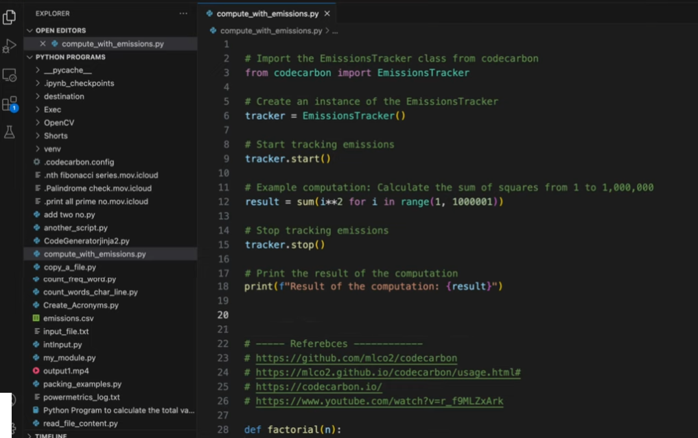

Wist je dat je multi-player game voor een groot deel in de “cloud” draait? Of je favoriete site? En dat de “cloud”
eigenlijk gewoon andermans computer is? Voor die games en websites moeten die computers soms hard werken. En hard werken
kost veel energie.

Maar als je wat meer aandacht besteed aan het schrijven van de software, kun je het energieverbruik zomaar flink
verlagen. En dat is beter voor het milieu! Ook als je zelf software schrijft kun je rekening houden met het
energieverbruik van je computer. Tijdens deze dojo gaan we met wat voorbeelden het verschil in energieverbruik laten
zien.

<!--more-->

We gaan eerst onze CO2 emissies opsporen om ze vervolgens te reduceren. Dit kan door verschillende technieken te gebruiken. 
3 links:

- [Code Carbon](https://codecarbon.io/)
- [Installing CodeCarbon — CodeCarbon 3.2.2 documentation](https://mlco2.github.io/codecarbon/installation.html)
- [GitHub - mlco2/codecarbon: Track emissions from Compute and recommend ways to reduce their impact on the environment.](https://github.com/mlco2/codecarbon)


